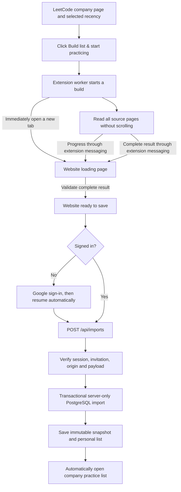
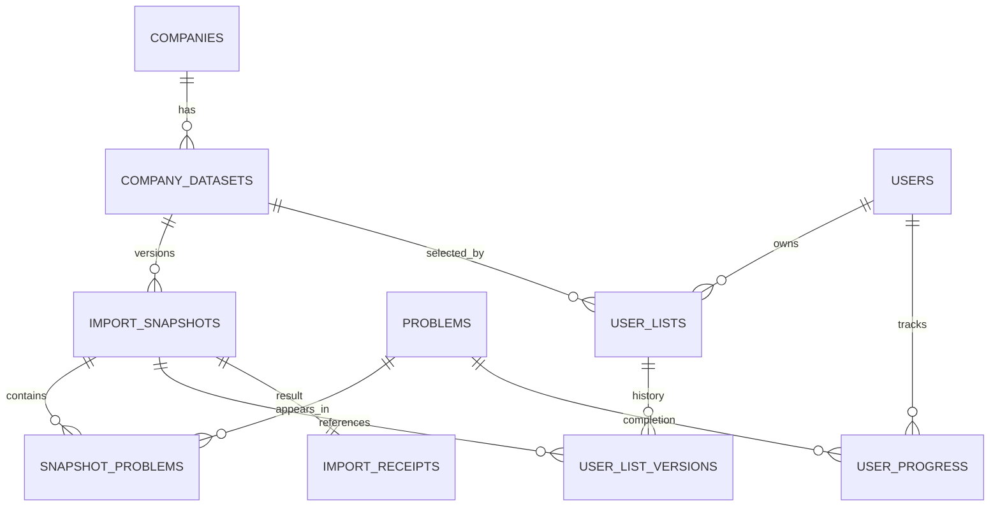
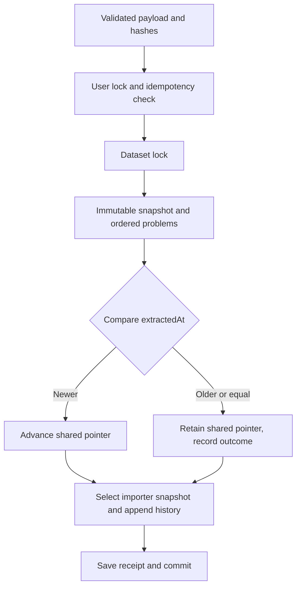

# Architecture

The extension's **Build list & start practicing** button starts the complete flow.
It immediately opens the website's loading page while the extension reads the
selected company and recency. The website receives the complete result, saves it
for the signed-in invited user, and opens the organized practice list automatically.



The loading page stays in the reading phase until a complete result arrives.
Cancelled, failed, or incomplete builds show an error and cannot advance to saving.
Google sign-in is required only when there is no authenticated session; the server
checks invitation eligibility before saving.

## One-click build sequence

```mermaid
sequenceDiagram
 participant U as User
 participant E as Extension worker
 participant L as LeetCode source tab
 participant W as Website /import
 participant A as Import API
 U->>E: Build list & start practicing
 E->>E: Capture source tab and persist task
 E->>W: Open loading page with task capability
 E->>L: Probe source and start extraction
 loop Until ready or terminal error
  L->>E: Progress/checkpoints
  W->>E: GET_PENDING_IMPORT
  E-->>W: building, ready, or error
 end
 W->>W: Validate complete result and retain locally
 opt Sign-in required
  W->>U: Sign in with Google
  U->>W: Return after OAuth; resume pending save
 end
 W->>A: POST /api/imports
 A-->>W: Saved list and warnings
 W->>U: Open company practice list automatically
```

There is no Extract-first prerequisite or web upload/confirmation step. Popup
closure does not cancel reading. Source changes and cancellation stop the task;
only a complete validated result reaches the import API.

## User flow and recovery

This is the current user flow for extension **0.5.1**. The website and extension
must use the same configured origin; the local build uses `http://localhost:3000`.
Saving requires configured Supabase credentials, Google sign-in, and an invitation.

### One action from LeetCode

1. Open a company page on `leetcode.com` and choose a recency.
2. Open the LeetByCompany extension at any scroll position.
3. Click **Build list & start practicing** once.
4. The extension opens the website in a new tab immediately, before reading the
   problem pages. The website shows **Building your practice list.**
5. Wait for the list to finish. If asked, sign in with your invited Google account.
   The pending list continues automatically after login.
6. After saving succeeds, the website opens the company's organized practice list
   at the selected recency. Use its topic, difficulty, and completion filters.

Keep the source LeetCode tab open with the same company and recency until reading
finishes. You can close the extension popup. No scrolling is needed; additional
LeetCode search, filters, and sorting are ignored when reading the full recency list.
The extension opens only when the user invokes it.

### What changed from the earlier flow

| Earlier interaction                                                           | Current behavior                                                                                                                         |
| ----------------------------------------------------------------------------- | ---------------------------------------------------------------------------------------------------------------------------------------- |
| Click **Extract problems**, then click **Build list & start practicing**      | A single **Build list & start practicing** click starts a new extraction and opens the website.                                          |
| Export JSON, choose a file on the website, preview it, then click Build again | The extension transfers the completed list automatically. The website has no file picker, manual import preview, or second Build button. |
| Wait in the popup until the list is ready                                     | The website opens before extraction and displays progress while work continues.                                                          |
| Use a separate extension Retry button                                         | After a source failure, return to LeetCode and click **Build list & start practicing** again.                                            |

**Export a backup → Export JSON** remains an optional extension action. It is not
part of building a practice list, and the website no longer has a JSON upload UI.
The popup's small problem preview is diagnostic; it does not require confirmation.

### Loading and completion

The website displays these phases in order:

| Phase   | Website message                      | Behavior                                                                                                                                                                              |
| ------- | ------------------------------------ | ------------------------------------------------------------------------------------------------------------------------------------------------------------------------------------- |
| Reading | **Gathering your problems…**         | Shows an initial connection message, then the number of problems read. A progress bar appears only when a total is available. No estimated percentage or completion time is invented. |
| Saving  | **Organizing and saving your list…** | Validates the complete result and saves it to the signed-in account.                                                                                                                  |
| Opening | **Opening your practice list…**      | Navigates automatically to the existing company practice view.                                                                                                                        |

The extension's primary button shows **Building your list…** and is disabled while
extraction is running. **Cancel** is available during extraction. Partial, cancelled,
or failed results never become a successfully saved practice list.

Opening **Add a list** directly without a pending build displays instructions to
start from the extension. It does not show a file upload control.

### Recovery

| Situation                                                                       | What to do                                                                                                                                          |
| ------------------------------------------------------------------------------- | --------------------------------------------------------------------------------------------------------------------------------------------------- |
| Sign-in required                                                                | Click **Sign in with Google** on the website. After login, saving resumes without another Build click.                                              |
| Account/database setup missing or saving temporarily unavailable                | The completed list stays in this browser. Finish setup or restore the service, then click the website's **Try again**.                              |
| Build cancelled, interrupted, incomplete, or the source company/recency changed | Return to the intended LeetCode company page and start a new build from the extension. The website's **Try again** does not start a new extraction. |
| A newer build replaced the previous one                                         | Use the website tab opened by the newer build. Only one extension task is retained.                                                                 |
| Build expired                                                                   | Start a new build. The extension handoff expires after 24 hours.                                                                                    |
| Website cannot reach the extension                                              | Use Chrome with LeetByCompany enabled and the configured website origin. Reload the extension and refresh LeetCode after upgrading.                 |

Reload and Google sign-in preserve the pending build in the same browser and
website origin. Once saving succeeds, the website clears its pending payload.

## Practice list organization

The company practice view renders the full matching snapshot as expanded,
collapsible topic sections rather than a paginated table. Topic, difficulty, and
completion dropdowns filter those sections together. Each source topic receives
its matching problems in source order; missing topics use Uncategorized. Problems
with multiple topics appear in each relevant section, while overall totals count
distinct identities and completion updates propagate to every occurrence.
Section headers show completed and total problem counts. The API's separate
paginated projection remains available; this view uses the complete snapshot.
Sections and the topic dropdown prioritize Top Interview 150's topic order,
followed by all remaining topics alphabetically. Sorting aliases place Array and
String first, Hash Table at Hashmap, Binary Tree at Binary Tree General, Graph at
Graph General, Heap (Priority Queue) at Heap, and generic Dynamic Programming at
the start of the DP sections. Source labels and memberships remain unchanged;
the view does not infer BFS or DP dimensionality from a problem's other tags.

## Database relationships



`001_leetbycompany.sql` enforces unique company slug, company/range, user/dataset,
user/problem progress, snapshot/problem membership and user/extraction idempotency.
Composite foreign keys keep shared/current/history pointers within their dataset.
Snapshot problem rows preserve titles, slugs, frontend IDs, topics, frequency, source
rank and position; later global problem updates do not rewrite historical display.
Internal LeetCode ID identifies progress across lists.

## Transaction and concurrency

`import_list` takes a per-user transaction advisory lock before checking idempotency,
then locks the dataset row before comparing freshness. The snapshot, membership,
shared pointer, personal pointer, history and receipt are committed together.
A constraint error rolls everything back. Company upsert also serializes imports
for the same company. No import changes progress.



Refresh uses the same per-user lock and a personal-list row lock. It verifies the
explicit target is newer and is still the shared winner. The action cannot silently
substitute another snapshot or downgrade the user. History reads never move pointers.

## Authorization model

The browser only contacts same-origin Next.js APIs. Routes call Supabase `getUser`,
then `require_member`; body-supplied user IDs are rejected by strict input schemas.
Only the server has the service key. Public tables have RLS enabled and no browser
role grants or allow policies: default denial is intentional. Authenticated/anonymous
roles cannot call privileged RPCs. Server-only RPCs recheck membership and ownership.
This avoids exposing uploader identifiers or raw import metadata through table APIs.

`read_list` authorizes the personal list and restricts historical snapshots to
that list's history. Knowing another snapshot/list/problem UUID is insufficient.
Newer-version offers expose only snapshot ID and extraction time for an eligible
dataset. Progress writes require a problem in the user's selected/history lists.

## Extension boundary

Chrome grants only activeTab, scripting and storage. The popup starts work and opens the building page immediately; the
worker binds task ID, tab, document, origin and live URL. The content script reads
source pages with the existing same-origin session. Closing the popup does not
cancel; changing company/recency does. The website retrieves build progress and the
completed result through exact-origin Chrome external messaging from a top-level
trusted `/import` page. Payloads are validated again at the website/API boundary.

Internally, `beginBuild` stores a random task access ID with a 24-hour expiry in
`chrome.storage.local` and puts that ID and the extension ID in the loading page's
URL fragment. This is an access limit for extension-to-website communication, not
a user-facing pending-import step or a 24-hour wait. The website polls
`GET_PENDING_IMPORT` while extraction runs. Only one extension task is retained;
a new build replaces the previous one.

LocalStorage retains the website's task access details or validated result across
reload and OAuth, without sending problem JSON in a URL. Once the website has
received the complete result, it retains that payload for saving retries and clears
it after a successful save. The extension handoff's 24-hour expiry applies when
retrieving from the extension; it is not a lifetime limit on saved practice lists.

## Limits

No server snapshot revision exists in the source API. Stable totals do not prove
point-in-time consistency. Client extraction time is untrusted freshness metadata.
Embedded PostgreSQL tests exercise transactions but not independent-process locking.
The API currently loads one complete authorized snapshot for in-memory filtering;
SQL pagination can replace this for larger datasets without changing contracts.
